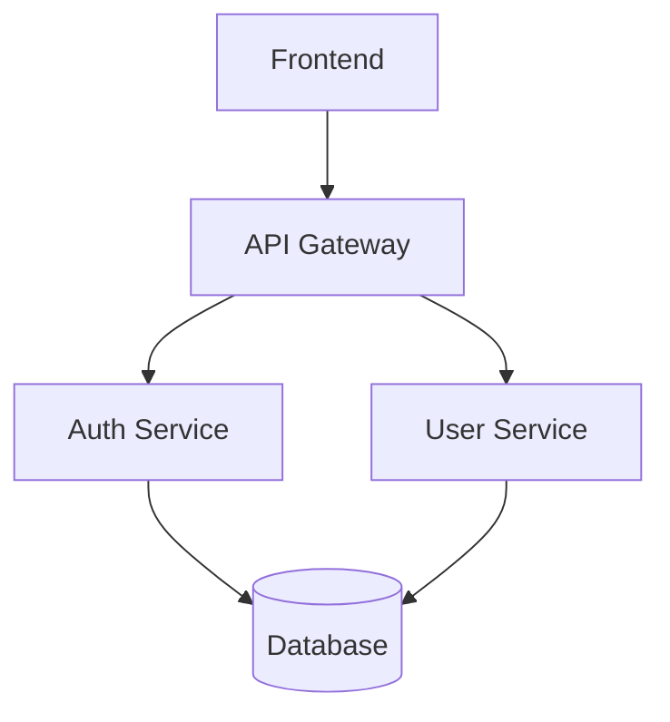

# Documentation Generator

🚀 **Automatically convert a directory tree of Markdown files into a professional Word document with rendered Mermaid diagrams**

## What It Does

- **Combines** all Markdown files from a directory tree into a single Word document
- **Renders** Mermaid diagrams as high-quality PNG images with intelligent caching
- **Maintains** proper alphabetical file ordering across the entire tree
- **Applies** custom Word styling via templates
- **Preserves** source file references for easy navigation

## Quick Start

### 1. Install Dependencies

**Windows:**
```bash
# Install Pandoc
winget install pandoc

# Install Node.js (includes npm)
winget install OpenJS.NodeJS

# Restart your command prompt, then install Mermaid CLI
npm install -g @mermaid-js/mermaid-cli
```

**macOS:**
```bash
# Install Pandoc
brew install pandoc

# Install Node.js
brew install node

# Install Mermaid CLI
npm install -g @mermaid-js/mermaid-cli
```

**Ubuntu/Debian:**
```bash
# Install Pandoc
sudo apt install pandoc

# Install Node.js
curl -fsSL https://deb.nodesource.com/setup_lts.x | sudo -E bash -
sudo apt-get install -y nodejs

# Install Mermaid CLI
npm install -g @mermaid-js/mermaid-cli
```

### 2. Verify Installation

```bash
pandoc --version     # Should show Pandoc version
node --version       # Should show Node.js version  
mmdc --version       # Should show Mermaid CLI version
```

### 3. Run the Generator

```bash
# Basic usage
python doc_generator.py docs/

# With custom filename
python doc_generator.py docs/ -f "Project Documentation.docx"

# With custom Word template
python doc_generator.py docs/ -t template.docx

# Custom output directory
python doc_generator.py docs/ -o output/
```

## Project Structure

```
project/
├── docs/                      # Your markdown files
│   ├── README.md             # Processed in alphabetical order
│   ├── overview.md           # Processed in alphabetical order
│   ├── 01-introduction/      # Processed in alphabetical order
│   │   ├── getting-started.md
│   │   └── concepts.md
│   └── 02-architecture/
│       ├── overview.md
│       └── diagrams.md
├── template.docx             # Optional: Word style template
├── doc_generator.py          # The generator script
└── build/                    # Generated output
    ├── output.docx          # Final Word document
    ├── combined.md          # Intermediate combined markdown
    └── images/              # Generated diagram images
        ├── diagram-a1b2c3d4.png
        └── diagram-e5f6g7h8.png
```

## Features

### ✅ Smart File Ordering
- Files processed in **alphabetical order** across the entire directory tree
- Natural sorting (file2.md before file10.md)
- Consistent ordering regardless of folder structure

### ✅ Mermaid Diagram Support with Caching
Your Markdown can include Mermaid diagrams:

```markdown
# System Architecture



This will be automatically converted to a PNG image in the Word document.
```

**Smart Caching:** Diagrams are cached using content hashes - only regenerated when content changes, with automatic cleanup of unused files.

### ✅ Word Template Support
Create a Word document with your desired styles, save it as `template.docx`, and use:
```bash
python doc_generator.py docs/ -t template.docx
```

The generator will apply your formatting to headings, paragraphs, and other elements.

## Command Line Options

```bash
python doc_generator.py <root_directory> [options]

Options:
  -o, --output DIR     Output directory (default: build)
  -f, --filename FILE  Output Word document filename (default: output.docx)
  -t, --template FILE  Word template file (.docx) for styling
  -h, --help          Show help message

Examples:
  python doc_generator.py docs/                              # Basic usage
  python doc_generator.py docs/ -o output/                   # Custom output
  python doc_generator.py docs/ -f "Final Report.docx"       # Custom filename
  python doc_generator.py docs/ -t template.docx             # With template
  python doc_generator.py docs/ -o final/ -f report.docx -t styles.docx     # Full custom
```

## Troubleshooting

### "npm is not recognized"
**Problem:** Node.js/npm not installed
**Solution:** 
1. Install Node.js from https://nodejs.org
2. Choose the **LTS version** (recommended)
3. Restart your command prompt
4. Verify with `node --version`

### "mmdc not found" (even after installation)
**Problem:** Windows PATH issues
**Solution:**
```bash
# Try force installation
npm install -g @mermaid-js/mermaid-cli --force

# Or with legacy peer deps
npm install -g @mermaid-js/mermaid-cli --legacy-peer-deps

# Restart command prompt and test
mmdc --version
```

### Images don't appear in Word document
**Problem:** Usually path-related (should be auto-fixed in this version)
**Solution:** Ensure you're running the latest version of the script

### Mermaid diagram generation fails
**Problem:** Invalid Mermaid syntax
**Solution:** 
- Test your diagrams at https://mermaid.live
- Ensure proper code block formatting:
  ```markdown
  ```mermaid
  graph TD
      A --> B
  ```
  ```

### Permission errors on Windows
**Problem:** Execution policy restrictions
**Solution:**
```powershell
# Run PowerShell as Administrator
Set-ExecutionPolicy -ExecutionPolicy RemoteSigned -Scope CurrentUser
```

### If you can't install Node.js/Mermaid CLI
**Problem:** Corporate restrictions or installation issues
**Solution:** The script requires both Pandoc and Mermaid CLI to function properly. If you cannot install these dependencies, you'll need to use an alternative documentation solution.

## Best Practices

### File Naming
Use numbered prefixes for intentional ordering:
```
docs/
├── README.md                 # Appears first alphabetically
├── 01-introduction/
│   ├── 01-overview.md
│   └── 02-concepts.md
└── 02-architecture/
    ├── 01-system-design.md
    └── 02-data-flow.md
```

### Mermaid Diagrams
- Keep diagrams simple and readable
- Use consistent themes
- Test complex diagrams at https://mermaid.live first
- Include descriptive text before/after diagrams

### Word Templates
- Create templates with proper heading styles (Heading 1, Heading 2, etc.)
- Define consistent fonts and spacing
- Include page headers/footers if needed
- Test templates with sample content first

## Advanced Usage

### Custom Styling
Create `template.docx` with:
- Custom fonts and colors
- Branded headers/footers  
- Specific margin settings
- Table of contents styles

### Batch Processing
Create a batch script for regular documentation builds:

**Windows (build.bat):**
```batch
@echo off
echo Building documentation...
python doc_generator.py docs/ -t company-template.docx -o output/
echo Done! Check output/output.docx
pause
```

**Mac/Linux (build.sh):**
```bash
#!/bin/bash
echo "Building documentation..."
python3 doc_generator.py docs/ -t company-template.docx -o output/
echo "Done! Check output/output.docx"
```

## Support

If you encounter issues:

1. **Check dependencies:** Ensure both Pandoc and Mermaid CLI are properly installed
2. **Test individually:** Verify `pandoc --version` and `mmdc --version` work
3. **Check file paths:** Ensure your markdown directory exists and contains .md files
4. **Restart terminal:** After installing Node.js/npm, restart your command prompt
5. **Test Mermaid syntax:** Validate diagrams at https://mermaid.live before using

## Requirements

This generator requires:
- **Pandoc** (for Markdown → Word conversion)
- **Node.js + Mermaid CLI** (for diagram rendering)
- **Python 3.6+** (for running the script)

All dependencies must be installed for the script to function properly.

## License

This script is provided as-is for documentation generation purposes. Modify and distribute freely.