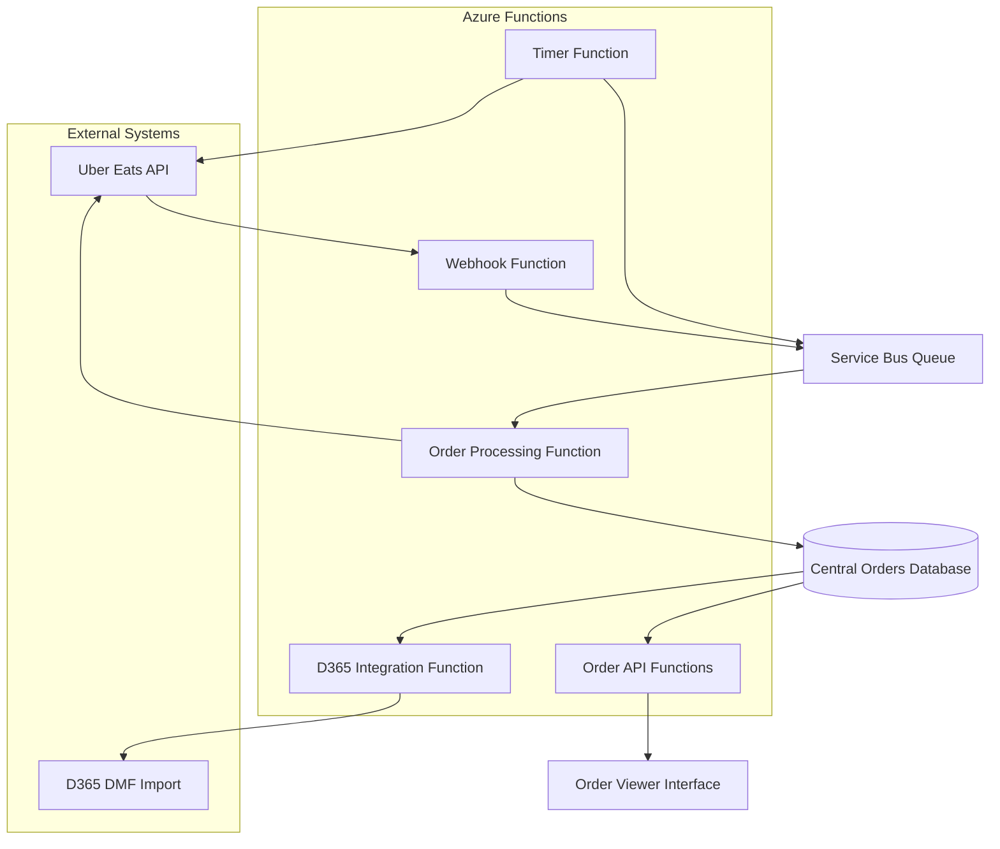
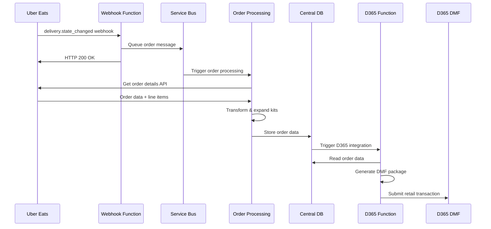
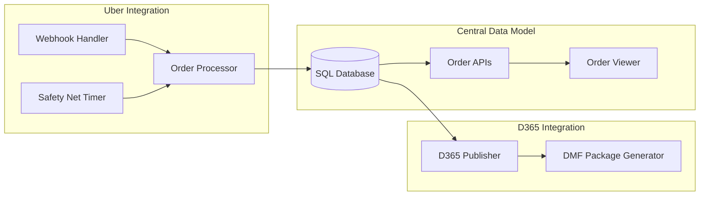
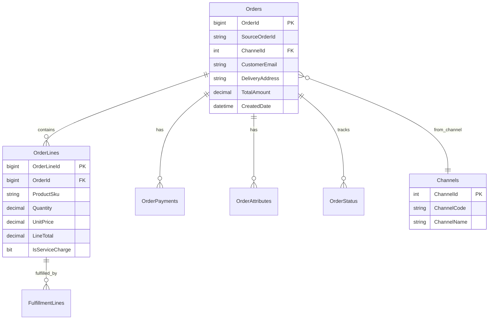

# Solution Architecture

## System Overview

## Data Flow Architecture

## Component Architecture

## Database Schema Overview

## Technology Stack

**Compute**: Azure Functions (HTTP, Queue, Timer triggers)

**Messaging**: Azure Service Bus (duplicate detection enabled)

**Storage**: Azure SQL Database

**Monitoring**: Application Insights

**Security**: Azure Key Vault for secrets

## Integration Patterns

**Webhook Processing**: Immediate acknowledgment with asynchronous processing

**Safety Net**: Periodic polling for missed orders with Service Bus deduplication

**Error Handling**: Exponential backoff retry with dead letter queues

**Kit Expansion**: Business logic transformation before D365 publishing
