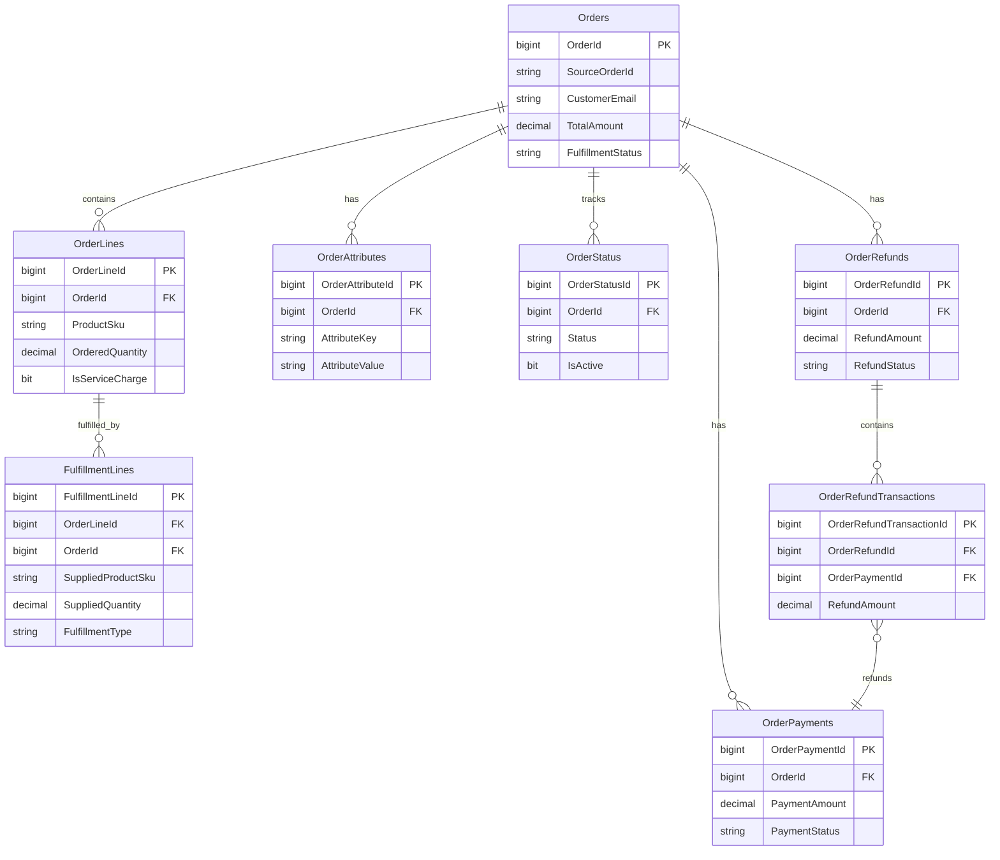

## Schema

### Entity Relationship Diagram

### Core Tables

#### Orders Table
Primary order header containing customer information, delivery details, and financial totals.

| Field | Type | Null | Description |
|-------|------|------|-------------|
| OrderId | BIGINT IDENTITY | No | Primary key |
| SourceOrderId | NVARCHAR(100) | No | Original order number from source platform |
| ChannelId | INT | No | FK to Channels table |
| OrderDate | DATETIMEOFFSET | No | When order was placed (AEST/AEDT) |
| FulfillmentStatus | NVARCHAR(20) | No | 'Pending', 'Picking', 'Fulfilled', 'Shipped', 'Cancelled' |
| CustomerEmail | NVARCHAR(320) | Yes | Customer email (nullable for privacy) |
| CustomerPhone | NVARCHAR(20) | Yes | Customer phone (Australian format) |
| CustomerFirstName | NVARCHAR(100) | Yes | Customer first name |
| CustomerLastName | NVARCHAR(100) | Yes | Customer last name |
| CustomerCompany | NVARCHAR(200) | Yes | Company name for business customers |
| CustomerABN | NVARCHAR(11) | Yes | Australian Business Number |
| DeliveryAddressLine1 | NVARCHAR(200) | Yes | Primary delivery address |
| DeliveryAddressLine2 | NVARCHAR(200) | Yes | Secondary address line |
| DeliverySuburb | NVARCHAR(100) | Yes | Delivery suburb |
| DeliveryCity | NVARCHAR(100) | Yes | Delivery city |
| DeliveryState | NVARCHAR(3) | Yes | Australian state code (NSW, VIC, etc.) |
| DeliveryPostcode | NVARCHAR(4) | Yes | Australian postcode |
| DeliveryInstructions | NVARCHAR(500) | Yes | Special delivery instructions |
| PromiseDate | DATE | Yes | Date promised to customer |
| DeliveryTypeId | INT | Yes | FK to DeliveryTypes table |
| DeliveryMethodId | INT | Yes | FK to DeliveryMethods table |
| SubtotalAmount | DECIMAL(10,2) | No | Sum of OrderLines.LineTotalInclusive |
| OrderDiscount | DECIMAL(10,2) | No | Header-level discount including GST |
| TotalTaxAmount | DECIMAL(10,2) | No | Total GST as provided by source |
| TotalAmount | DECIMAL(10,2) | No | SubtotalAmount - OrderDiscount |
| OriginalPaymentAmount | DECIMAL(10,2) | Yes | Initial charge from sales channel |
| FulfilledOrderAmount | DECIMAL(10,2) | Yes | Final amount after fulfillment |
| PaymentAdjustmentAmount | DECIMAL(10,2) | Yes | Refund/charge needed |
| PaymentReconciliationStatus | NVARCHAR(20) | No | 'NotRequired', 'Pending', 'Processed', 'Failed' |
| CreatedDate | DATETIMEOFFSET | No | When order created in central system |
| FulfilledDate | DATETIMEOFFSET | Yes | When fulfillment completed |
| SourceData | NVARCHAR(MAX) | Yes | JSON payload from source platform |
| Notes | NVARCHAR(1000) | Yes | Internal operational notes |

#### OrderLines Table
Customer intent - what was originally ordered before fulfillment modifications.

| Field | Type | Null | Description |
|-------|------|------|-------------|
| OrderLineId | BIGINT IDENTITY | No | Primary key |
| OrderId | BIGINT | No | FK to Orders table |
| SourceLineId | NVARCHAR(100) | Yes | Line identifier from source platform |
| LineNumber | INT | No | Display sequence for order line |
| ProductSku | NVARCHAR(100) | No | Product SKU as ordered |
| ProductName | NVARCHAR(500) | No | Product description |
| ProductCategory | NVARCHAR(100) | Yes | Product category for reporting |
| IsVariableWeight | BIT | No | Product sold by weight |
| IsServiceCharge | BIT | No | Service charge/fee vs physical product |
| OrderedQuantity | DECIMAL(10,3) | No | Quantity requested by customer |
| UnitPriceInclusive | DECIMAL(10,2) | No | Price per unit including GST |
| LineSubtotalInclusive | DECIMAL(10,2) | No | Quantity × UnitPriceInclusive |
| LineDiscount | DECIMAL(10,2) | No | Discount amount including GST |
| LineDiscountPercentage | DECIMAL(5,4) | Yes | Discount percentage if provided |
| LineTotalInclusive | DECIMAL(10,2) | No | LineSubtotalInclusive - LineDiscount |
| LineTaxAmount | DECIMAL(10,2) | No | GST amount from source system |
| CreatedDate | DATETIMEOFFSET | No | When line created |

#### FulfillmentLines Table
Business reality - what was actually picked and supplied to customer.

| Field | Type | Null | Description |
|-------|------|------|-------------|
| FulfillmentLineId | BIGINT IDENTITY | No | Primary key |
| OrderLineId | BIGINT | No | FK to OrderLines table |
| OrderId | BIGINT | No | FK to Orders table |
| SuppliedProductSku | NVARCHAR(100) | No | Actual SKU supplied |
| SuppliedProductName | NVARCHAR(500) | No | Name of product supplied |
| SuppliedQuantity | DECIMAL(10,3) | No | Actual quantity supplied |
| FulfillmentType | NVARCHAR(20) | No | 'Exact', 'Substitution', 'Short', 'Over' |
| SystemId | INT | No | FK to Systems table |
| PickedBy | NVARCHAR(100) | Yes | Staff member who picked |
| PickedDate | DATETIMEOFFSET | No | When line was picked |
| UnitPriceInclusive | DECIMAL(10,2) | No | Price charged including GST |
| LineDiscountApplied | DECIMAL(10,2) | No | Discount amount applied |
| LineTotalInclusive | DECIMAL(10,2) | No | Final line total after discounts |
| LineTaxAmount | DECIMAL(10,2) | No | GST amount for supplied items |
| Notes | NVARCHAR(500) | Yes | Fulfillment notes |

#### OrderPayments Table
Payment methods and amounts for reconciliation.

| Field | Type | Null | Description |
|-------|------|------|-------------|
| OrderPaymentId | BIGINT IDENTITY | No | Primary key |
| OrderId | BIGINT | No | FK to Orders table |
| SourceTransactionId | NVARCHAR(100) | Yes | Platform transaction reference |
| PaymentTypeId | INT | No | FK to PaymentTypes table |
| PaymentAmount | DECIMAL(10,2) | No | Amount paid via this method |
| PaymentReference | NVARCHAR(100) | Yes | Platform payment reference |
| PaymentStatus | NVARCHAR(20) | No | 'Processed', 'Pending', 'Failed' |
| CreatedDate | DATETIMEOFFSET | No | When payment record created |

#### OrderAttributes Table
Flexible storage for platform-specific metadata.

| Field | Type | Null | Description |
|-------|------|------|-------------|
| OrderAttributeId | BIGINT IDENTITY | No | Primary key |
| OrderId | BIGINT | No | FK to Orders table |
| SystemId | INT | No | FK to Systems table |
| AttributeKey | NVARCHAR(100) | No | Attribute identifier |
| AttributeValue | NVARCHAR(500) | Yes | Attribute value |
| CreatedDate | DATETIMEOFFSET | No | When attribute created |
| CreatedBy | NVARCHAR(100) | Yes | System or user that created |

**Constraint**: UNIQUE(OrderId, SystemId, AttributeKey)

### Reference Tables (Configuration-Driven Expansion)

#### Channels Table
Configurable sales channels for business expansion.

| Field | Type | Description | Initial Data |
|-------|------|-------------|--------------|
| ChannelId | INT IDENTITY | Primary key | |
| ChannelCode | NVARCHAR(20) | Unique identifier | SHOPIFY, UBEREATS, AMAZON |
| ChannelName | NVARCHAR(100) | Display name | Shopify Store, Uber Eats, Amazon Fresh |
| ChannelDescription | NVARCHAR(500) | Detailed description | |
| IsActive | BIT | Channel availability | DEFAULT 1 |
| CreatedDate | DATETIMEOFFSET | When channel added | |
| CreatedBy | NVARCHAR(100) | User who added | |

#### PaymentTypes Table
Configurable payment methods.

| Field | Type | Description | Initial Data |
|-------|------|-------------|--------------|
| PaymentTypeId | INT IDENTITY | Primary key | |
| PaymentTypeCode | NVARCHAR(20) | Unique identifier | CREDITCARD, GIFTCARD, PAYPAL, UBEREATS |
| PaymentTypeName | NVARCHAR(100) | Display name | Credit Card, Gift Card, PayPal, Uber Eats |
| PaymentTypeDescription | NVARCHAR(500) | Detailed description | |
| IsActive | BIT | Payment method availability | DEFAULT 1 |
| CreatedDate | DATETIMEOFFSET | When payment method added | |
| CreatedBy | NVARCHAR(100) | User who added | |

#### DeliveryTypes Table
Configurable delivery service levels.

| Field | Type | Description | Initial Data |
|-------|------|-------------|--------------|
| DeliveryTypeId | INT IDENTITY | Primary key | |
| DeliveryTypeCode | NVARCHAR(20) | Unique identifier | STANDARD, EXPRESS, SAMEDAY, PICKUP |
| DeliveryTypeName | NVARCHAR(100) | Display name | Standard Delivery, Express Delivery, Same Day, Click & Collect |
| DeliveryTypeDescription | NVARCHAR(500) | Service level description | |
| IsActive | BIT | Delivery type availability | DEFAULT 1 |
| CreatedDate | DATETIMEOFFSET | When delivery type added | |
| CreatedBy | NVARCHAR(100) | User who added | |

#### DeliveryMethods Table
Configurable delivery mechanisms.

| Field | Type | Description | Initial Data |
|-------|------|-------------|--------------|
| DeliveryMethodId | INT IDENTITY | Primary key | |
| DeliveryMethodCode | NVARCHAR(20) | Unique identifier | COURIER, SELFPICKUP, THIRDPARTY |
| DeliveryMethodName | NVARCHAR(100) | Display name | Courier Delivery, Self Pickup, Third Party |
| DeliveryMethodDescription | NVARCHAR(500) | Method description | |
| IsActive | BIT | Delivery method availability | DEFAULT 1 |
| CreatedDate | DATETIMEOFFSET | When delivery method added | |
| CreatedBy | NVARCHAR(100) | User who added | |

#### Systems Table
Configurable system integrations for attribution and fulfillment tracking.

| Field | Type | Description | Initial Data |
|-------|------|-------------|--------------|
| SystemId | INT IDENTITY | Primary key | |
| SystemCode | NVARCHAR(20) | Unique identifier | SHOPIFY, UBEREATS, AMAZON, PICKINGAPP, INTERNAL |
| SystemName | NVARCHAR(100) | Display name | Shopify Store, Uber Eats, Amazon Fresh, HFM Picking App, Internal System |
| SystemType | NVARCHAR(20) | System category | CHANNEL, INTERNAL, INTEGRATION, ANALYTICS |
| SystemDescription | NVARCHAR(500) | System purpose | |
| IsActive | BIT | System integration status | DEFAULT 1 |
| CreatedDate | DATETIMEOFFSET | When system added | |
| CreatedBy | NVARCHAR(100) | User who added | |

### Key Business Rules

**Data Integrity**

- Every order must have at least one OrderLine
- Only one OrderStatus record per order can have IsActive = 1
- Australian postcodes must be 4 digits
- ABN must be 11 digits if provided
- Reference table codes must be unique within each table

**Financial Calculations**

- TotalAmount = SubtotalAmount - OrderDiscount
- PaymentAdjustmentAmount = FulfilledOrderAmount - OriginalPaymentAmount
- Tax amounts supplied by source systems, not calculated by Central Order System

**Service Charges**

- IsServiceCharge = 1 indicates fees, charges, and services (delivery, tips, platform fees)
- IsServiceCharge = 0 indicates physical products requiring inventory management

**Order States**

- FulfillmentLines can only exist for orders with status 'Picking' or later
- FulfilledOrderAmount set when fulfillment completes
- PaymentReconciliationStatus = 'NotRequired' for pre-fulfilled orders (Uber Eats, Amazon)

### Indexing Strategy

**Primary Performance Indexes**

- Primary keys on all tables
- Orders.SourceOrderId for platform integration lookups
- Orders.ChannelId for reporting and channel-specific queries
- Orders.CreatedDate for date-based reporting
- OrderLines.ProductSku for inventory management
- OrderAttributes(OrderId, SystemId) for metadata queries

**Lookup Optimization**

- Channels.ChannelCode, PaymentTypes.PaymentTypeCode, etc. for reference table lookups
- All reference tables (IsActive) for active record filtering
- OrderStatus(OrderId, IsActive) for current status lookups