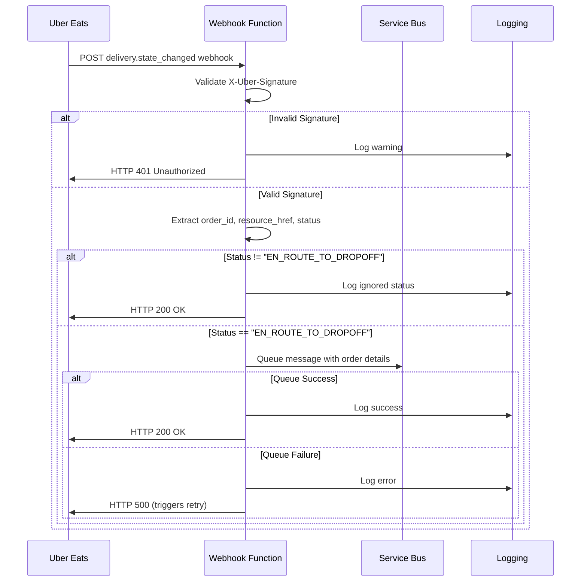

## Webhook Function Implementation

### Function Requirements

**Build**: HTTP-triggered Azure Function to receive Uber Eats delivery state change webhooks

**Function Name**: `UberWebhookHandler` (or similar)

**Trigger**: HTTP POST requests from Uber Eats webhook service

**Purpose**: Capture fulfilled orders and queue them for asynchronous processing

### Overview

Uber Eats sends `delivery.state_changed` webhooks when order delivery status changes. The webhook function captures orders that have been handed off to couriers and queues them for asynchronous processing.

### Webhook Flow



### Webhook Configuration

**Uber Eats Configuration**:

- Configure webhook URL as "Primary Webhook URL" in Uber Developer Dashboard
- Location: Setup section > Webhooks
- Uber Eats supports only one primary webhook URL per application

**Webhook Type**: `delivery.state_changed`

**Trigger Condition**: `meta.status = "EN_ROUTE_TO_DROPOFF"`

**Endpoint**: HTTP-triggered Azure Function

**Method**: POST

### Webhook Payload Structure

```json
{
  "event_id": "unique-event-identifier",
  "event_type": "delivery.state_changed",
  "event_time": "2024-01-15T10:30:00Z",
  "resource_href": "https://api.uber.com/v1/delivery/orders/{order_id}",
  "meta": {
    "order_id": "12345678-1234-1234-1234-123456789012",
    "store_id": "store-uuid",
    "status": "EN_ROUTE_TO_DROPOFF"
  }
}
```

### Webhook Function Implementation

#### Security Validation

```csharp
// Validate X-Uber-Signature header
var signature = request.Headers["X-Uber-Signature"];
var computedSignature = ComputeHmacSha256(requestBody, clientSecret);
if (!signature.Equals(computedSignature, StringComparison.OrdinalIgnoreCase))
{
    return new UnauthorizedResult();
}
```

#### Payload Processing

```csharp
// Extract essential information
var orderId = payload.meta.order_id;
var resourceHref = payload.resource_href;
var status = payload.meta.status;

// Filter for correct status
if (status != "EN_ROUTE_TO_DROPOFF")
{
    logger.LogInformation("Ignoring webhook for OrderId={OrderId}, Status={Status}", orderId, status);
    return new OkResult(); // Ignore other statuses
}

// Queue for async processing
var message = new ServiceBusMessage(JsonSerializer.Serialize(new
{
    OrderId = orderId,
    ResourceHref = resourceHref,
    ReceivedAt = DateTime.UtcNow
}))
{
    MessageId = $"uber-order-{orderId}", // For deduplication
    ContentType = "application/json"
};

await serviceBusClient.SendMessageAsync(message);
```

#### Response Handling

```csharp
// Return success after queuing (or after ignoring non-target statuses)
return new OkResult(); // HTTP 200 with empty body
```

### Key Technical Requirements

**Immediate Response**: Function must return HTTP 200 within seconds to prevent Uber Eats retries

**Signature Validation**: All webhook requests must be validated using X-Uber-Signature header

**Status Filtering**: Only process orders with status "EN_ROUTE_TO_DROPOFF"

**Deduplication**: Use consistent MessageId format for Service Bus duplicate detection

**Error Handling**: Log failures but still return HTTP 200 to prevent webhook retries

### Webhook Retry Behavior

If the webhook function fails to respond with HTTP 200, Uber Eats will retry using exponential backoff:

- Initial retry: 10 seconds
- Subsequent retries: 30 seconds, 60 seconds, etc.
- Maximum: 7 total attempts

### Configuration Requirements

**Environment Variables**:

- `UBER_CLIENT_SECRET`: For webhook signature validation
- `SERVICE_BUS_CONNECTION_STRING`: For message queuing
- `UBER_ORDER_QUEUE_NAME`: Target queue name

**Azure Function Settings**:

- Runtime: .NET 8 (LTS)
- Timeout: 30 seconds maximum
- HTTP trigger with anonymous access level

### Monitoring and Logging

**Success Metrics**:

- Webhook receipt count
- Valid signature percentage
- Queue message success rate
- Response time distribution

**Error Conditions and Handling**:

- **Invalid signature**: Log warning and return HTTP 401 Unauthorized
- **Malformed payload**: Log error and return HTTP 400 Bad Request  
- **Service Bus failures**: Log error and return HTTP 500 (triggers Uber retry)
- **All other errors**: Log error and return HTTP 500 (triggers Uber retry)

**Logging Requirements**:

```csharp
logger.LogInformation("Uber webhook received: OrderId={OrderId}, Status={Status}", 
    orderId, status);
    
logger.LogWarning("Invalid webhook signature from IP: {IPAddress}", 
    request.HttpContext.Connection.RemoteIpAddress);
```

### Security Considerations

**Signature Verification**: Always validate X-Uber-Signature header using HMAC-SHA256
**Environment Variables**: Store UBER_CLIENT_SECRET in Azure Key Vault, not app settings
**HTTPS Only**: Ensure webhook endpoint uses HTTPS (required by Uber Eats)
**Payload Validation**: Validate required fields (meta.order_id, resource_href) exist before processing
