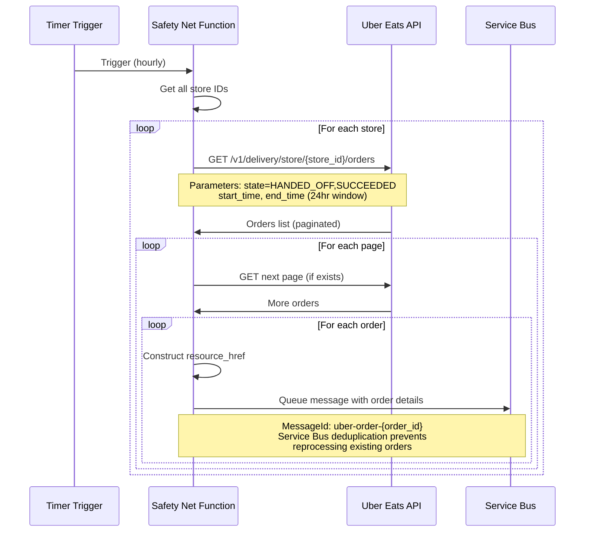

## Safety Net for Missed Orders

### Function Requirements

**Build**: Timer-triggered Azure Function to identify missed orders

**Function Name**: `UberSafetyNetProcessor` (or similar)

**Trigger**: Timer schedule (e.g., hourly)

**Purpose**: Query Uber Eats API for orders in valid states that may have been missed by webhooks

### Overview

While webhooks provide reliable real-time notifications, network conditions and external service issues can occasionally cause missed events. The safety net function periodically queries the Uber Eats API directly to identify orders in valid integration states and queues them for processing.

**Key Point**: The safety net queues messages to the same Service Bus queue as the webhook function - it doesn't process orders directly.

### Safety Net Flow



### API Integration

#### Authentication

```csharp
// Generate application access token with eats.store.orders.read scope
var tokenRequest = new
{
    client_id = clientId,
    client_secret = clientSecret,
    grant_type = "client_credentials",
    scope = "eats.store.orders.read"
};

var tokenResponse = await httpClient.PostAsync("https://auth.uber.com/oauth/v2/token", content);
```

#### Store Iteration

```csharp
// Iterate through all stores provisioned to the developer account
var stores = await GetProvisionedStores(); // Implementation specific

foreach (var store in stores)
{
    await ProcessStoreOrders(store.StoreId);
}
```

#### Order Query

```csharp
// Query orders in valid states within rolling 24-hour window
var startTime = DateTime.UtcNow.AddHours(-24).ToString("yyyy-MM-ddTHH:mm:ssZ");
var endTime = DateTime.UtcNow.ToString("yyyy-MM-ddTHH:mm:ssZ");

var requestUrl = $"https://api.uber.com/v1/delivery/store/{storeId}/orders" +
                $"?state=HANDED_OFF,SUCCEEDED" +
                $"&start_time={startTime}" +
                $"&end_time={endTime}" +
                $"&page_size=50";

var response = await httpClient.GetAsync(requestUrl);
```

#### Pagination Handling

```csharp
var ordersResponse = JsonSerializer.Deserialize<OrdersListResponse>(responseContent);

// Process current page orders
await ProcessOrdersPage(ordersResponse.orders);

// Continue with next page if exists
if (!string.IsNullOrEmpty(ordersResponse.next_page_token))
{
    var nextPageUrl = $"{requestUrl}&next_page_token={ordersResponse.next_page_token}";
    await ProcessNextPage(nextPageUrl);
}
```

#### Message Queuing

```csharp
// Queue each order using same structure as webhook
foreach (var order in orders)
{
    var resourceHref = $"https://api.uber.com/v1/delivery/orders/{order.order_id}";
    
    var message = new ServiceBusMessage(JsonSerializer.Serialize(new
    {
        OrderId = order.order_id,
        ResourceHref = resourceHref,
        ReceivedAt = DateTime.UtcNow,
        Source = "SafetyNet" // Optional: distinguish from webhook messages
    }))
    {
        MessageId = $"uber-order-{order.order_id}", // Same format as webhook
        ContentType = "application/json"
    };

    await serviceBusClient.SendMessageAsync(message);
}
```

### Service Bus Deduplication

The safety net relies on Service Bus duplicate detection to prevent reprocessing:

- **MessageId Format**: `uber-order-{order_id}` (identical to webhook function)
- **Duplicate Detection Window**: Configure for at least 7 days
- **Automatic Rejection**: Service Bus automatically rejects duplicate messages
- **No External Queries**: No need to check Central Orders database for existing orders

### Key Technical Requirements

**State Filtering**: Only query orders in "HANDED_OFF" or "SUCCEEDED" states

**Time Window**: Use rolling 24-hour window to focus on recent orders

**Pagination**: Handle all pages of results using next_page_token

**Token Caching**: Cache and reuse access tokens (valid for 30 days)

**Error Handling**: Implement exponential backoff for API failures

### Timer Configuration

**Schedule**: Hourly execution (adjust based on business needs)

**Cron Expression**: `0 0 * * * *` (every hour on the hour)

**Timeout**: 10 minutes maximum for processing all stores

**Retry**: Function-level retry on failure

### Configuration Requirements

**Environment Variables**:

- `UBER_CLIENT_ID`: Application client ID
- `UBER_CLIENT_SECRET`: Application client secret
- `SERVICE_BUS_CONNECTION_STRING`: Same queue as webhook function
- `UBER_ORDER_QUEUE_NAME`: Target queue name
- `SAFETY_NET_WINDOW_HOURS`: Time window for order lookup (default: 24)

**Azure Function Settings**:

- Runtime: .NET 8 (LTS)
- Timeout: 600 seconds (10 minutes)
- Timer trigger with specified cron schedule

### Monitoring and Logging

**Success Metrics**:

- Orders queried per store
- Messages queued successfully
- Duplicate messages rejected
- API response times

**Error Conditions**:

- Authentication failures
- Store access denied
- API rate limiting
- Service Bus connection failures

### Error Handling

**API Failures**: Implement exponential backoff with maximum retry attempts

**Authentication Issues**: Log error and skip current execution

**Rate Limiting**: Respect Uber's rate limits and back off appropriately

**Service Bus Failures**: Log error but continue processing other orders
