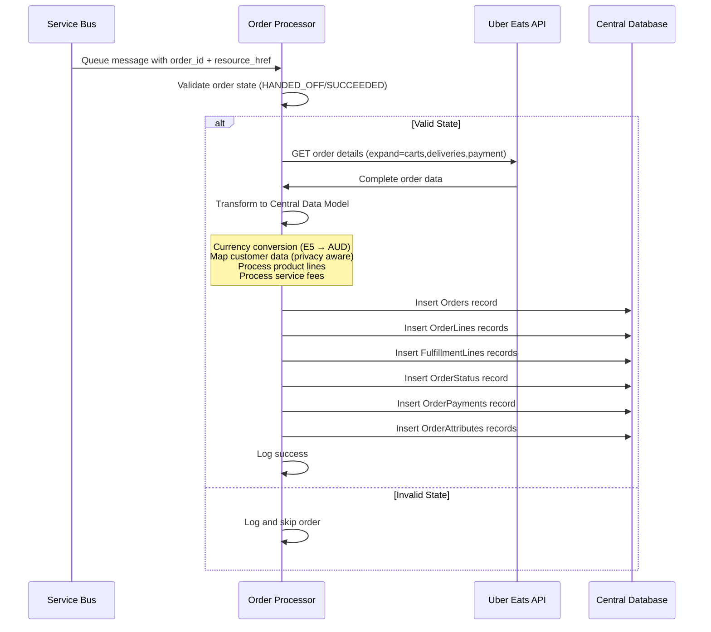

## Order Mapping

### Function Requirements

**Build**: Queue-triggered Azure Function to process Uber Eats orders

**Function Name**: `UberOrderProcessor` (or similar)

**Trigger**: Service Bus queue messages from webhook and safety net functions

**Purpose**: Retrieve order details from Uber Eats API and transform into Central Orders data model

### Overview

The order mapping function processes queued messages containing Uber Eats order IDs and resource URLs. It retrieves complete order details from the Uber Eats API and transforms the data into the Central Orders database schema.

**Key Processing Points**:

- Orders arrive as already fulfilled (no picking required)
- Currency conversion from E5 format to AUD decimal
- OrderLines and FulfillmentLines contain identical data (Intent = Reality)
- Service fees processed as separate order lines

### Order Processing Flow



### Order Retrieval from Uber Eats API

#### Authentication

```csharp
// Use cached application token with eats.store.orders.read scope
var accessToken = await GetCachedAccessToken();
httpClient.DefaultRequestHeaders.Authorization = 
    new AuthenticationHeaderValue("Bearer", accessToken);
```

#### Order Details Request

```csharp
// Use resource_href from queue message with required expansions
var orderUrl = $"{resourceHref}?expand=carts,deliveries,payment";
var response = await httpClient.GetAsync(orderUrl);

if (!response.IsSuccessStatusCode)
{
    // Log error and potentially retry based on HTTP status
    logger.LogError("Failed to retrieve order {OrderId}: {StatusCode}", 
        orderId, response.StatusCode);
    return;
}

var orderData = await response.Content.ReadAsStringAsync();
var order = JsonSerializer.Deserialize<UberOrderResponse>(orderData);
```

#### Order State Validation

```csharp
// Validate order is in appropriate state for integration
var validStates = new[] { "HANDED_OFF", "SUCCEEDED" };
if (!validStates.Contains(order.state))
{
    logger.LogWarning("Order {OrderId} in invalid state: {State}", 
        orderId, order.state);
    return; // Skip processing
}
```

### Data Mapping to Central Data Model

#### Currency Conversion (E5 Format)

```csharp
// Uber uses E5 format: divide by 100,000 to get AUD decimal
public static decimal ConvertE5ToAud(long amountE5)
{
    return amountE5 / 100000m;
}

// Example: 1250000 E5 = 12.50 AUD
var totalAmount = ConvertE5ToAud(order.payment.payment_detail.order_total.gross.amount_e5);
```

#### Orders Table Mapping

```csharp
var orderRecord = new Order
{
    SourceOrderId = order.id,
    ChannelId = await GetChannelId("UBEREATS"),
    OrderDate = DateTimeOffset.Parse(order.created_time),
    FulfillmentStatus = "Fulfilled",
    
    // Customer data (privacy-aware, nullable)
    CustomerEmail = order.customers?[0]?.tax_profile?.email,
    CustomerPhone = order.customers?[0]?.contact?.phone?.number,
    CustomerFirstName = order.customers?[0]?.name?.first_name,
    CustomerLastName = order.customers?[0]?.name?.last_name,
    CustomerCompany = null, // Not available from Uber
    CustomerABN = null, // Not available from Uber
    
    // Delivery information
    DeliveryAddressLine1 = order.deliveries?[0]?.location?.street_address_line_one,
    DeliveryAddressLine2 = order.deliveries?[0]?.location?.street_address_line_two,
    DeliveryCity = order.deliveries?[0]?.location?.city,
    DeliveryPostcode = order.deliveries?[0]?.location?.postal_code,
    DeliveryInstructions = order.deliveries?[0]?.instructions,
    DeliverySuburb = null, // Not available from Uber
    DeliveryState = null, // Not available from Uber
    
    // Promise date from scheduled time or estimated dropoff
    PromiseDate = GetPromiseDate(order),
    DeliveryTypeId = await GetDeliveryTypeId("STANDARD"),
    DeliveryMethodId = await GetDeliveryMethodId("THIRDPARTY"),
    
    // Financial totals (E5 conversion)
    SubtotalAmount = ConvertE5ToAud(order.payment.payment_detail.item_charges.subtotal_including_promos.gross.amount_e5),
    OrderDiscount = Math.Abs(ConvertE5ToAud(order.payment.payment_detail.promotions.total.gross.amount_e5)),
    TotalTaxAmount = ConvertE5ToAud(order.payment.payment_detail.order_total.tax.amount_e5),
    TotalAmount = ConvertE5ToAud(order.payment.payment_detail.order_total.gross.amount_e5),
    
    // Payment reconciliation (not required for Uber)
    OriginalPaymentAmount = ConvertE5ToAud(order.payment.payment_detail.order_total.gross.amount_e5),
    FulfilledOrderAmount = ConvertE5ToAud(order.payment.payment_detail.order_total.gross.amount_e5),
    PaymentAdjustmentAmount = null,
    PaymentReconciliationStatus = "NotRequired",
    
    // System tracking
    CreatedDate = DateTimeOffset.UtcNow,
    FulfilledDate = DateTimeOffset.UtcNow,
    SourceData = orderData, // Store original JSON
    Notes = null
};
```

#### OrderLines Processing (Products and Service Fees)

```csharp
var orderLines = new List<OrderLine>();
var lineNumber = 1;

// Process product items
foreach (var item in order.carts[0].items)
{
    var priceBreakdown = GetPriceBreakdown(order, item.cart_item_id);
    
    orderLines.Add(new OrderLine
    {
        OrderId = savedOrder.OrderId,
        SourceLineId = item.cart_item_id,
        LineNumber = lineNumber++,
        ProductSku = item.id,
        ProductName = item.title,
        ProductCategory = null, // Not available from Uber
        IsVariableWeight = IsWeightBasedProduct(item),
        IsServiceCharge = false,
        OrderedQuantity = ConvertE5ToDecimal(item.quantity.in_sellable_unit.amount_e5),
        UnitPriceInclusive = ConvertE5ToAud(priceBreakdown.unit.gross.amount_e5),
        LineSubtotalInclusive = ConvertE5ToAud(priceBreakdown.total.gross.amount_e5),
        LineDiscount = ConvertE5ToAud(priceBreakdown.discount.total.gross.amount_e5),
        LineDiscountPercentage = null, // Not available from Uber
        LineTotalInclusive = ConvertE5ToAud(priceBreakdown.total.gross.amount_e5) - 
                            ConvertE5ToAud(priceBreakdown.discount.total.gross.amount_e5),
        LineTaxAmount = ConvertE5ToAud(priceBreakdown.total.tax.amount_e5) - 
                       ConvertE5ToAud(priceBreakdown.discount.total.tax.amount_e5),
        CreatedDate = DateTimeOffset.UtcNow
    });
}

// Process service fees
foreach (var fee in order.payment.payment_detail.fees.details)
{
    var feeMapping = GetServiceFeeMapping(fee.id);
    
    orderLines.Add(new OrderLine
    {
        OrderId = savedOrder.OrderId,
        SourceLineId = fee.id,
        LineNumber = lineNumber++,
        ProductSku = feeMapping.Sku, // e.g., "UBER_DELIVERY_FEE"
        ProductName = feeMapping.Name, // e.g., "Uber Delivery Fee"
        ProductCategory = null,
        IsVariableWeight = false,
        IsServiceCharge = true,
        OrderedQuantity = 1,
        UnitPriceInclusive = ConvertE5ToAud(fee.amount.gross.amount_e5),
        LineSubtotalInclusive = ConvertE5ToAud(fee.amount.gross.amount_e5),
        LineDiscount = 0, // Service fees typically not discounted
        LineDiscountPercentage = null,
        LineTotalInclusive = ConvertE5ToAud(fee.amount.gross.amount_e5),
        LineTaxAmount = ConvertE5ToAud(fee.amount.tax.amount_e5),
        CreatedDate = DateTimeOffset.UtcNow
    });
}
```

#### FulfillmentLines Processing (Mirror OrderLines)

```csharp
// For Uber orders, FulfillmentLines mirror OrderLines exactly
var fulfillmentLines = orderLines.Select(ol => new FulfillmentLine
{
    OrderLineId = ol.OrderLineId,
    OrderId = ol.OrderId,
    SuppliedProductSku = ol.ProductSku,
    SuppliedProductName = ol.ProductName,
    SuppliedQuantity = ol.OrderedQuantity,
    FulfillmentType = "Exact", // Pre-fulfilled orders always exact
    SystemId = await GetSystemId("UBEREATS"),
    PickedBy = null, // Not available for external fulfillment
    PickedDate = savedOrder.OrderDate,
    UnitPriceInclusive = ol.UnitPriceInclusive,
    LineDiscountApplied = ol.LineDiscount,
    LineTotalInclusive = ol.LineTotalInclusive,
    LineTaxAmount = ol.LineTaxAmount,
    Notes = null
}).ToList();
```

#### OrderStatus Record

```csharp
var orderStatus = new OrderStatus
{
    OrderId = savedOrder.OrderId,
    Status = "Dispatched", // Static for completed Uber orders
    StatusDate = DateTimeOffset.UtcNow,
    UpdatedBy = "UBER_INTEGRATION",
    Notes = null,
    IsActive = true
};
```

#### OrderPayments Record

```csharp
var orderPayment = new OrderPayment
{
    OrderId = savedOrder.OrderId,
    SourceTransactionId = null, // Not provided by Uber
    PaymentTypeId = await GetPaymentTypeId("UBEREATS"),
    PaymentAmount = ConvertE5ToAud(order.payment.payment_detail.order_total.gross.amount_e5),
    PaymentReference = order.id,
    PaymentStatus = "Processed",
    CreatedDate = DateTimeOffset.UtcNow
};
```

#### OrderAttributes Processing

```csharp
var attributes = new List<OrderAttribute>();
var systemId = await GetSystemId("UBEREATS");

// Store key Uber-specific attributes
var attributeMappings = new Dictionary<string, string>
{
    ["uber_display_id"] = order.display_id,
    ["uber_store_id"] = order.store.id,
    ["uber_store_name"] = order.store.name,
    ["delivery_partner_name"] = order.deliveries?[0]?.delivery_partner?.name,
    ["delivery_partner_vehicle"] = order.deliveries?[0]?.delivery_partner?.vehicle?.type,
    ["special_instructions"] = order.carts?[0]?.special_instructions
};

foreach (var attr in attributeMappings.Where(a => !string.IsNullOrEmpty(a.Value)))
{
    attributes.Add(new OrderAttribute
    {
        OrderId = savedOrder.OrderId,
        SystemId = systemId,
        AttributeKey = attr.Key,
        AttributeValue = attr.Value,
        CreatedDate = DateTimeOffset.UtcNow,
        CreatedBy = "UBER_INTEGRATION"
    });
}
```

### Service Fee Mapping

```csharp
private ServiceFeeMapping GetServiceFeeMapping(string feeId)
{
    var mappings = new Dictionary<string, ServiceFeeMapping>
    {
        ["DELIVERY_FEE"] = new("UBER_DELIVERY_FEE", "Uber Delivery Fee"),
        ["SMALL_ORDER_FEE"] = new("UBER_SMALL_ORDER_FEE", "Small Order Fee"),
        ["PICK_AND_PACK_FEE"] = new("UBER_PICK_PACK_FEE", "Pick & Pack Fee"),
        ["BAG_FEE"] = new("UBER_BAG_FEE", "Bag Fee")
    };
    
    return mappings.GetValueOrDefault(feeId, 
        new ServiceFeeMapping($"UBER_{feeId}", $"Uber {feeId}"));
}
```

### Key Implementation Notes

**Currency Conversion**: All Uber monetary amounts use E5 format (divide by 100,000 for AUD)

**Privacy Handling**: Customer data fields are nullable and may be null due to privacy constraints

**Service Charges**: Processed as separate OrderLines with IsServiceCharge = true

**Pre-fulfilled Orders**: FulfillmentLines mirror OrderLines exactly since orders are already completed

**Reference Data**: Lookup IDs for Channels, Systems, PaymentTypes, etc. from configured tables

**Error Handling**: Store original JSON in SourceData for troubleshooting

### Configuration Requirements

**Environment Variables**:

- `UBER_CLIENT_ID`: Application client ID
- `UBER_CLIENT_SECRET`: Application client secret
- `DATABASE_CONNECTION_STRING`: Central Orders database connection
- `SERVICE_BUS_CONNECTION_STRING`: For message processing

**Azure Function Settings**:

- Runtime: .NET 8 (LTS)
- Timeout: 300 seconds (5 minutes)
- Service Bus trigger with single message processing

### Error Handling

**API Failures**: Retry with exponential backoff for HTTP 5xx errors

**Invalid States**: Log warning and skip processing for orders not in HANDED_OFF/SUCCEEDED state

**Data Validation**: Log errors for missing required fields but continue processing where possible

**Database Failures**: Log error and let Service Bus retry message processing

**Currency Conversion**: Validate E5 values are within expected ranges before conversion
