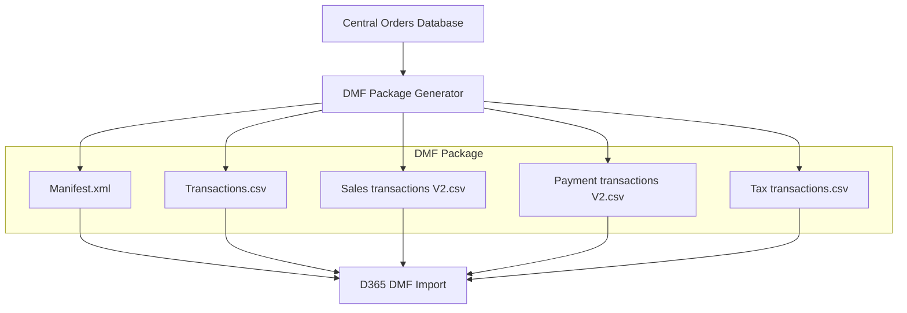

## Batch Updates via DMF

### Function Requirements

**Build**: Timer-triggered or queue-triggered Azure Function for D365 batch processing

**Function Name**: `D365DmfProcessor` (or similar)

**Trigger**: Timer schedule or Service Bus message from Central Orders system

**Purpose**: Generate DMF packages from Central Orders data and submit to D365 for batch processing

### Overview

The D365 integration uses Data Management Framework (DMF) to process orders in batches rather than individual OData API calls. This approach leverages D365's proven retail transaction structure and provides better performance for high-volume order processing.

**Key Approach**:

- Generate DMF packages containing CSV files and manifest configuration
- Use existing retail transaction entities (RetailTransactionEntity, RetailTransactionSalesLineV2Entity, etc.)
- Process orders in batches for improved efficiency
- Leverage D365's built-in validation and business logic

### DMF Package Structure

### DMF Entity Structure

The DMF package will contain four main CSV files corresponding to D365 retail transaction entities:

#### 1. Transactions.csv (RetailTransactionEntity)

- **Purpose**: Transaction headers containing order totals and customer information
- **Key Fields**: TransactionNumber, OperatingUnitNumber, CustomerAccount, GrossAmount, NetAmount, PaymentAmount
- **Source**: Central Orders.Orders table

#### 2. Sales transactions V2.csv (RetailTransactionSalesLineV2Entity)  

- **Purpose**: Individual line items within transactions
- **Key Fields**: TransactionNumber, LineNumber, ItemId, Quantity, Price, NetAmount, SalesTaxAmount
- **Source**: Central Orders.OrderLines and potentially FulfillmentLines tables

#### 3. Payment transactions V2.csv (RetailTransactionPaymentLineV2Entity)

- **Purpose**: Payment method details for transactions
- **Key Fields**: TransactionNumber, TenderType, AmountTendered, CurrencyCode
- **Source**: Central Orders.OrderPayments table

#### 4. Tax transactions.csv (RetailTransactionTaxLineEntity)

- **Purpose**: Detailed tax calculations per sales line
- **Key Fields**: TransactionNumber, SalesLineNumber, TaxCode, TaxAmount, TaxPercentage
- **Source**: Tax amounts from Central Orders.OrderLines table

### Processing Flow

> **⚠️ IMPLEMENTATION PENDING**
>
> The detailed processing flow and technical implementation are currently being designed based on the Central Orders to D365 mapping requirements.

**Conceptual Flow**:

1. **Order Selection**: Query Central Orders database for orders ready for D365 processing
2. **Data Transformation**: Convert Central Orders data to DMF CSV format
3. **Package Generation**: Create DMF package with CSV files and manifest
4. **D365 Submission**: Submit package to D365 DMF import process
5. **Status Tracking**: Monitor import progress and handle errors

### Key Technical Considerations

**Batch Processing**: Process multiple orders in single DMF package for efficiency

**Error Handling**: D365 DMF provides built-in error reporting and retry capabilities

**Data Validation**: Leverage D365's existing retail transaction validation rules

**Performance**: DMF batch processing significantly more efficient than individual API calls

**Monitoring**: Track package submission status and processing results

### Configuration Requirements

**Environment Variables**:

- `D365_ENVIRONMENT_URL`: D365 Finance & Operations environment URL
- `D365_CLIENT_ID`: Azure AD application client ID
- `D365_CLIENT_SECRET`: Azure AD application client secret
- `D365_TENANT_ID`: Azure AD tenant ID
- `DATABASE_CONNECTION_STRING`: Central Orders database connection

**Azure Function Settings**:

- Runtime: .NET 8 (LTS)
- Timeout: 1800 seconds (30 minutes) for batch processing
- Timer trigger or Service Bus trigger based on processing requirements

### DMF Package Authentication

**Azure AD Authentication**: Use service principal for D365 API access

**DMF API Endpoints**: Leverage D365 Data Management REST APIs for package submission

**Token Management**: Cache and refresh authentication tokens as needed

### Error Handling and Monitoring

**Package Validation**: Validate CSV format and required fields before submission

**Import Status**: Monitor D365 import job status and completion

**Error Recovery**: Handle failed imports with retry logic and error reporting

**Logging**: Comprehensive logging for troubleshooting and audit trails

**Detailed implementation specifications will be provided once the Central Orders to D365 mapping is finalized.**
